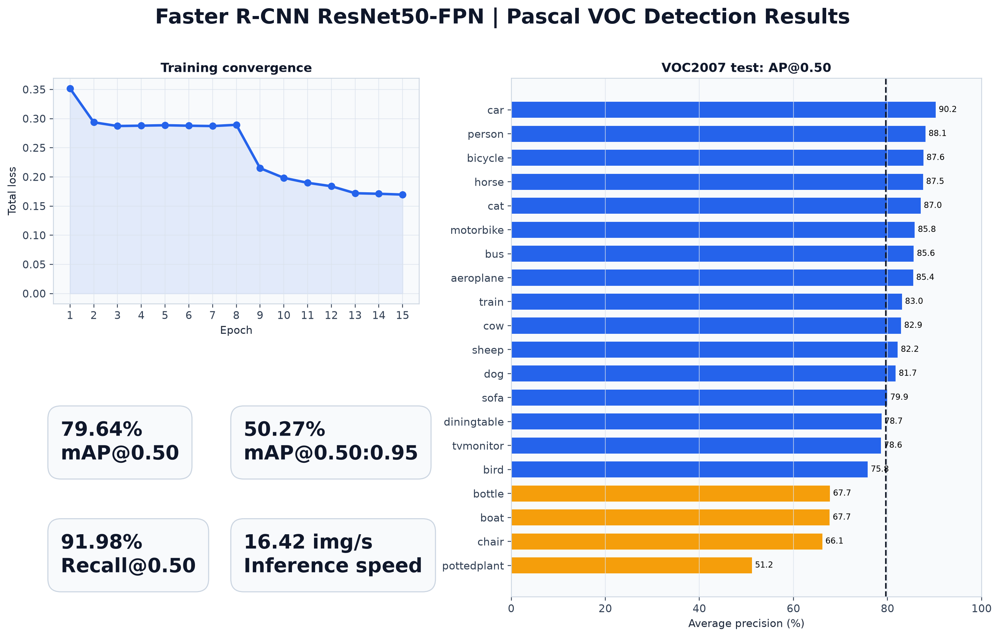
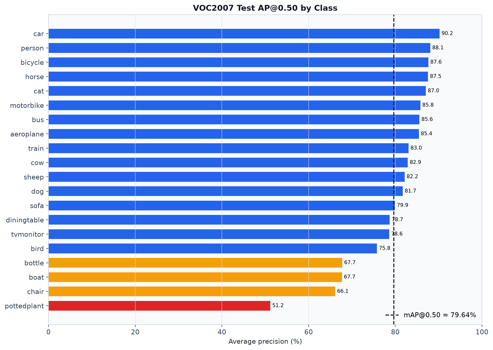
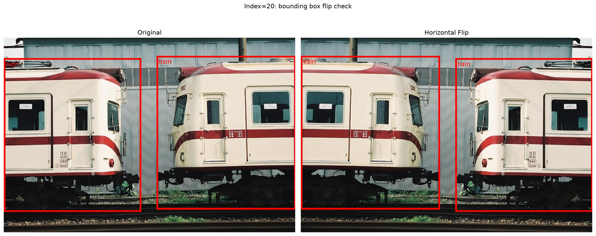
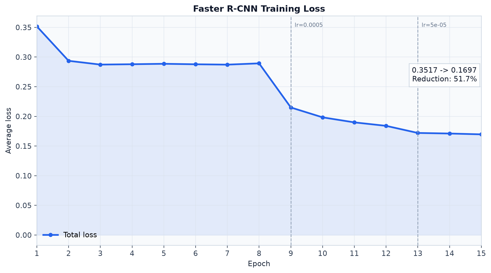

# Faster R-CNN on Pascal VOC 2007+2012

基于 PyTorch / TorchVision 实现的完整目标检测项目，覆盖 Pascal VOC 数据下载、XML 标注解析、数据增强、Faster R-CNN 训练、断点续训、VOC 指标评估、预测可视化与实验图表生成。

本项目采用 COCO 预训练的 **Faster R-CNN ResNet50-FPN**，将检测头替换为 Pascal VOC 的 `20 类 + 1 个背景类`，并在 VOC2007 test 上取得 **79.64% mAP@0.50**。



## 主要功能

- 自定义 `VOCDataset`，将 VOC XML 标注转换为 TorchVision 检测模型要求的 `boxes`、`labels`、`area`、`iscrowd` 与 `difficult`。
- 图像与边界框同步水平翻转，避免增强后标注错位。
- 支持不同尺寸图片和不同目标数量的检测任务 `collate_fn`。
- 使用 Faster R-CNN ResNet50-FPN、SGD、MultiStepLR 与 CUDA AMP 训练。
- 支持训练日志、定期 checkpoint、`latest.pth` 以及断点续训。
- 实现 VOC AP、mAP、Precision、Recall，并正确忽略 `difficult=1` 目标。
- 支持 VOC2007 11-point AP 和积分 AP 两种计算方式。
- 提供数据标注检查、小样本过拟合测试、预测对比可视化和汇报图表。

## 实验结果

测试数据为 **VOC2007 test，共 4,952 张图片**。下表采用积分 AP，评估时保留分数不低于 `0.05` 的预测，每张图片最多保留 100 个检测结果。

| 指标 | 结果 |
|---|---:|
| mAP@0.50 | **79.64%** |
| mAP@0.50:0.95 | **50.27%** |
| Precision@IoU=0.50 | 24.46% |
| Recall@IoU=0.50 | 91.98% |
| 推理速度 | 16.42 images/s |
| 测试图片数 | 4,952 |

> Precision 与 Recall 同时受 `score-threshold` 影响。这里使用较低的 `0.05` 阈值，以保留完整的置信度排序并计算 AP，因此 Recall 较高而 Precision 较低。实际可视化推荐使用 `0.5`。

类别 AP@0.50 中，`car` 表现最好（90.22%），`pottedplant` 相对较弱（51.16%）。完整结果见 [`metrics_voc2007_test_score005.json`](outputs/evaluation/metrics_voc2007_test_score005.json)。



## 数据划分

| 用途 | 数据集 | 图片数 | 数据增强 |
|---|---|---:|---|
| 训练 | VOC2007 train + VOC2012 train | 8,218 | 随机水平翻转 |
| 验证 | VOC2007 val + VOC2012 val | 8,333 | 无 |
| 测试 | VOC2007 test | 4,952 | 无 |

训练阶段排除 `difficult=1` 的目标；验证和测试阶段保留这些标注，并按照 VOC 规则在匹配时忽略 difficult 目标。

## 项目结构

```text
object_detection_project/
├── dataset_process/
│   ├── build_datasets.py       # 构建 train / val / test 数据集
│   ├── data_loader.py          # DataLoader 与 collate_fn
│   ├── download_voc.py         # 下载 VOC2007 / VOC2012
│   └── voc_dataset.py          # XML 解析、Tensor 转换与数据增强
├── models/
│   └── faster_rcnn.py          # Faster R-CNN 模型构建
├── outputs/
│   ├── evaluation/             # 评估指标 JSON
│   ├── fasterrcnn_voc/logs/    # 训练日志 CSV
│   └── report_figures/         # Loss、AP 与汇总图
├── evaluator.py                # VOC 评估程序
├── overfit_test.py             # 8 张图片小样本过拟合测试
├── plot_results.py             # 生成实验图表
├── test_dataloader.py          # DataLoader 检查
├── test_model.py               # 单批次前向/反向传播检查
├── train.py                    # 正式训练与断点续训
├── visualize_dataset.py        # GT 框和水平翻转检查
├── visualize_overfit.py        # 小样本过拟合结果检查
└── visualize_predictions.py    # Ground Truth / Prediction 对比
```

数据集、虚拟环境与模型 checkpoint 未上传到仓库，需要在本地下载或训练生成。

## 环境配置

建议使用 Python 3.10 或更高版本，并根据本机 CUDA 环境从 [PyTorch 安装页面](https://pytorch.org/get-started/locally/) 选择匹配的 `torch` 和 `torchvision`。

Windows PowerShell：

```powershell
git clone https://github.com/hukaihukai123/object_detection_project.git
cd object_detection_project

python -m venv .venv
.\.venv\Scripts\Activate.ps1
python -m pip install --upgrade pip
pip install torch torchvision numpy matplotlib pillow
```

检查 PyTorch 与 CUDA：

```powershell
python -c "import torch; print('PyTorch:', torch.__version__); print('CUDA available:', torch.cuda.is_available()); print('CUDA:', torch.version.cuda)"
```

## 下载 Pascal VOC

```powershell
python .\dataset_process\download_voc.py
```

下载完成后的目录应为：

```text
data/
└── VOCdevkit/
    ├── VOC2007/
    │   ├── Annotations/
    │   ├── ImageSets/
    │   └── JPEGImages/
    └── VOC2012/
        ├── Annotations/
        ├── ImageSets/
        └── JPEGImages/
```

## 训练前检查

### 1. 检查 DataLoader

```powershell
python .\test_dataloader.py
```

### 2. 检查一次前向与反向传播

```powershell
python .\test_model.py
```

### 3. 小样本过拟合测试

```powershell
python .\overfit_test.py
python .\visualize_overfit.py
```

小样本 Loss 应明显下降，借此检查数据、标签、模型、优化器和反向传播能否形成完整闭环。

## 正式训练

本项目实验使用 15 个 epoch、batch size 1、初始学习率 0.005：

```powershell
python .\train.py --epochs 15 --batch-size 1 --num-workers 2 --lr 0.005 --output-dir .\outputs\fasterrcnn_voc
```

训练配置：

| 配置项 | 数值 |
|---|---:|
| Optimizer | SGD |
| Initial learning rate | 0.005 |
| Momentum | 0.9 |
| Weight decay | 0.0005 |
| LR milestones | epoch 8, 12 |
| LR decay factor | 0.1 |
| Batch size | 1 |
| Epochs | 15 |
| Random seed | 42 |
| AMP | CUDA 环境下启用 |

训练日志保存在：

```text
outputs/fasterrcnn_voc/logs/train_log.csv
```

checkpoint 保存在：

```text
outputs/fasterrcnn_voc/checkpoints/latest.pth
outputs/fasterrcnn_voc/checkpoints/epoch_005.pth
outputs/fasterrcnn_voc/checkpoints/epoch_010.pth
...
```

### 断点续训

`--epochs` 表示最终训练到的总 epoch 数，而不是额外训练的轮数：

```powershell
python .\train.py --epochs 15 --batch-size 1 --num-workers 2 --lr 0.005 --output-dir .\outputs\fasterrcnn_voc --resume .\outputs\fasterrcnn_voc\checkpoints\latest.pth
```

## 模型评估

### 联合验证集

```powershell
python .\evaluator.py --checkpoint .\outputs\fasterrcnn_voc\checkpoints\latest.pth --split val --batch-size 1 --num-workers 2 --score-threshold 0.05 --output .\outputs\evaluation\metrics_val_score005.json
```

### VOC2007 test

```powershell
python .\evaluator.py --checkpoint .\outputs\fasterrcnn_voc\checkpoints\latest.pth --split test --batch-size 1 --num-workers 2 --score-threshold 0.05 --output .\outputs\evaluation\metrics_voc2007_test_score005.json
```

如果需要复现 VOC2007 论文时期常用的 11-point AP，在命令末尾加入：

```text
--voc07-metric
```

当前仓库展示的 `79.64% mAP@0.50` 使用的是积分 AP，没有开启该选项。

## 可视化

### 标注与水平翻转检查

```powershell
python .\visualize_dataset.py --year 2007 --split train --index 20 --compare-flip --save .\outputs\flip_check.jpg
```



### 真实框与预测框对比

随机可视化 10 张联合验证集图片，预测阈值为 0.5：

```powershell
python .\visualize_predictions.py --checkpoint .\outputs\fasterrcnn_voc\checkpoints\latest.pth --years 2007 2012 --split val --num-images 10 --score-threshold 0.5
```

结果保存在：

```text
outputs/prediction_visualizations/
```

### 生成 Loss 与 AP 图表

```powershell
python .\plot_results.py --training-csv .\outputs\fasterrcnn_voc\logs\train_log.csv --metrics-json .\outputs\evaluation\metrics_voc2007_test_score005.json --output-dir .\outputs\report_figures
```



## 结果分析

- 总训练 Loss 从 `0.3517` 降至 `0.1697`，下降约 **51.7%**。
- Epoch 3–8 进入平台期；学习率在 epoch 8 和 12 后衰减，Loss 随后继续下降。
- VOC2007 test 上 `car`、`person`、`bicycle`、`horse` 和 `cat` 表现较好。
- `pottedplant`、`chair`、`boat` 与 `bottle` 相对较弱，主要挑战来自小目标、遮挡、背景干扰和类别内部差异。
- mAP 随 IoU 阈值提高而明显下降，说明后续改进重点可以放在边界框定位精度上。

## 局限与后续工作

- 当前数据增强仅使用随机水平翻转，可以增加尺度抖动、颜色扰动等增强。
- 当前训练只使用两个年份的 `train` 子集；确定超参数后，可使用 VOC2007+2012 `trainval` 重新训练，并在 VOC2007 test 上进行标准最终评估。
- 可以针对小目标调整 RPN anchor 尺度，并分析对 `pottedplant`、`bottle` 等类别的影响。
- 可以与 Faster R-CNN MobileNet、RetinaNet 或轻量级 YOLO 模型比较精度、速度和显存占用。
- 可以补充 PR 曲线、混淆矩阵，以及误检、漏检和重复检测的定性分析。

## 参考资料

- [Faster R-CNN: Towards Real-Time Object Detection with Region Proposal Networks](https://arxiv.org/abs/1506.01497)
- [The PASCAL Visual Object Classes Challenge](http://host.robots.ox.ac.uk/pascal/VOC/)
- [TorchVision Object Detection Models](https://pytorch.org/vision/stable/models/faster_rcnn.html)

## 致谢

感谢 Pascal VOC 提供公开目标检测数据集，以及 PyTorch / TorchVision 提供模型实现和预训练权重。
